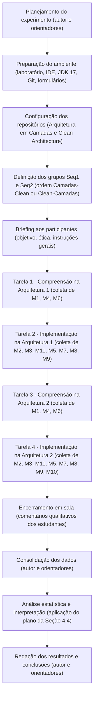

# Plano de Experimento – Scoping e Planejamento  
## Avaliação Experimental da Clean Architecture versus Arquitetura em Camadas: Impactos na Clareza de Design e Facilidade de Evolução

---

## 1. Identificação básica

### 1.1 Título do experimento
**Avaliação Experimental da Clean Architecture versus Arquitetura em Camadas: Impactos na Clareza de Design e Facilidade de Evolução**

### 1.2 ID / código
- **ID / código do estudo**: 1389014

### 1.3 Versão do documento e histórico de revisão
- **Versão atual do plano**: v1.3  
- **Histórico resumido**:
  - **v1.0** – Primeira versão do planejamento do experimento, com definição inicial de objetivos, escopo e desenho experimental.
  - **v1.1** – Inclusão e refinamento do modelo GQM, detalhamento de métricas e tarefas dos participantes.
  - **v1.2** – Consolidação do delineamento intra-sujeito, protocolo operacional em sala de aula e plano de análise de dados.
  - **v1.3** – Alinhamento completo ao template de “Plano de Experimento – Scoping e Planejamento”, com inclusão explícita de seções sobre validade, ética, governança, documentação e comunicação.

### 1.4 Datas (criação, última atualização)
- **Data de criação deste plano**: 23/11/2025
- **Última atualização**: 05/12/2025  

### 1.5 Autores (nome, área, contato)
- **Pedro Henrique Moreira Caixeta Ferreira**  
  - Área: Engenharia de Software  
  - Curso: Bacharelado em Engenharia de Software – PUC Minas  
  - E-mail: 1389014@sga.pucminas.br

### 1.6 Responsável principal (PI / dono do experimento)
- **Responsável principal (para fins deste plano e da disciplina)**:  
  - Pedro Henrique Moreira Caixeta Ferreira

### 1.7 Projeto / produto / iniciativa relacionada
- Trabalho de Conclusão de Curso (TCC) em Engenharia de Software – PUC Minas:  
  “**Avaliação Experimental da Clean Architecture versus Arquitetura em Camadas: Impactos na Clareza de Design e Facilidade de Evolução**”.

---

## 2. Contexto e problema

### 2.1 Descrição do problema / oportunidade

Decisões de arquitetura de software influenciam diretamente a compreensão, a evolução e a manutenibilidade de sistemas, afetando esforço, custo e qualidade do produto. A literatura sobre dívida arquitetural e padrões de projeto indica que decisões estruturais mal fundamentadas tendem a aumentar defeitos, retrabalho, esforço de manutenção e risco de _smells_ ao longo do tempo, além de impactar atributos como testabilidade e capacidade de evolução. :contentReference[oaicite:1]{index=1}  

Nesse cenário:

- A **arquitetura em camadas tradicional** consolidou-se como um estilo amplamente adotado, frequentemente a primeira forma de separação de responsabilidades ensinada em materiais didáticos e suportada por frameworks (controller–service–repository).
- A **Clean Architecture** propõe maior independência do domínio em relação a detalhes de infraestrutura, com separação mais rigorosa entre regras de negócio e mecanismos de entrega, persistência e integração.

Apesar do uso difundido dessas abordagens, **faltam evidências empíricas controladas** que comparem, em um mesmo conjunto de funcionalidades, a Clean Architecture e a arquitetura em camadas sob a perspectiva de **clareza de design** e **facilidade de evolução**. Muitas vezes, a Clean Architecture é tratada como “evolução natural” da arquitetura em camadas com base em opiniões e relatos de experiência, e não em dados.

> **Problema central**  
> Em que medida a adoção da Clean Architecture, em comparação à arquitetura em camadas tradicional, impacta a clareza do design e a facilidade de evolução de sistemas de software, considerando aspectos como compreensibilidade, modularidade, manutenibilidade e esforço de modificação?

### 2.2 Contexto organizacional e técnico

- **Organização / contexto**  
  - Curso de Bacharelado em Engenharia de Software – PUC Minas.  
  - Experimento conduzido em disciplina com laboratório de informática, como parte de TCC I/TCC II.

- **Ambiente técnico do experimento** :contentReference[oaicite:2]{index=2}  
  - Linguagem: Java 17  
  - Framework: Spring Boot 3.3.x  
  - Ferramentas:
    - IDE: IntelliJ IDEA 2024.2 (ou equivalente compatível)  
    - Controle de versão: Git  
    - Coleta de percepções: Google Forms (questionário eletrônico)
  - Ambiente: laboratório de informática com estações homogêneas (hardware e software) e acesso à internet/repositórios.

- **Processo / forma de execução**  
  - Estudo empírico do tipo **experimento controlado em sala de aula**, com delineamento **intra-sujeito (within-subjects)**.  
  - Participantes: aproximadamente 70 estudantes de Engenharia de Software. 
  - Tarefas: compreensão de código, implementação de modificação simples e resposta a questionário.

### 2.3 Trabalhos e evidências prévias (internos e externos)

O experimento se ancora em trabalhos que tratam de:

- **Trade-offs de patterns e arquiteturas**  
  - Vale et al. (2022): estudo empírico com profissionais sobre _patterns_ em microserviços e seus impactos em atributos de qualidade (desempenho, escalabilidade, manutenibilidade, etc.).
  - Bogner et al. (2024): experimento controlado com 65 participantes sobre padrões de API em microserviços, usando o indicador TAU (Timed Actual Understandability).

- **Impacto de padrões de projeto em manutenibilidade**  
  - Elish (2025): estudo empírico sobre _Maintainability Index_ e uso de padrões de projeto.  
  - Zhang & Li (2022): efeitos de _over-engineering_ com padrões sobre manutenibilidade, mostrando que aplicar padrões sem força motriz clara pode piorar a manutenção. 

- **Dívida arquitetural e _smells_**  
  - Sousa (2024): abordagem sistemática para identificar dívida arquitetural.  
  - Wedyan & Abufakher (2020): revisão sistemática sobre impacto de padrões na qualidade. :contentReference[oaicite:6]{index=6}  

- **Desafios em estudos empíricos em arquitetura**  
  - Falessi et al. (2010): destacam a carência de evidências empíricas sistemáticas em arquitetura e os desafios para experimentos controlados, replicação e uso de métodos mistos.

Internamente, o projeto de TCC já definiu:

- Uma fundamentação teórica sobre Clean Architecture e arquitetura em camadas.
- Um delineamento experimental preliminar com tarefas, métricas e análise estatística planejada.

### 2.4 Referencial teórico e empírico essencial

**Clean Architecture**  
- Estilo voltado a manter o núcleo de regras de negócio independente de detalhes de implementação.  
- Organização em círculos concêntricos (entidades, casos de uso, adaptadores, frameworks/drivers), com dependências apontando sempre de fora para dentro.  
- Objetivo: favorecer clareza de design, testabilidade e facilidade de evolução, especialmente em cenários com mudanças tecnológicas frequentes. 

**Arquitetura em camadas tradicional**  
- Organização horizontal em camadas (apresentação, negócio, dados, infraestrutura).  
- Fortemente suportada por frameworks (controller, service, repository em Spring Boot).  
- Simplicidade e familiaridade, mas com risco de acoplamento maior entre lógica de negócio e detalhes de infraestrutura.  

**Referencial empírico**  
- Uso de métricas objetivas (tempo, tamanho da mudança, MI, smells, etc.) e de percepções (Likert) para avaliar impactos de estilo arquitetural em clareza, compreensibilidade e manutenção.  
- Emprego de métodos estatísticos (Shapiro–Wilk, Wilcoxon Signed-Rank) para comparação entre condições experimentais pareadas.

---

## 3. Objetivos e questões (Goal / Question / Metric)

### 3.1 Objetivo geral (Goal template / GQM)

> **Analisar** duas versões de um mesmo sistema Java/Spring Boot (uma em arquitetura em camadas tradicional e outra em Clean Architecture)  
> **com o propósito de** comparar empiricamente estilos arquiteturais  
> **com respeito ao** impacto na clareza de design e na facilidade de evolução do código  
> **do ponto de vista de** estudantes e pesquisadores de Engenharia de Software  
> **no contexto de** um experimento controlado em laboratório de informática em disciplina de Engenharia de Software na PUC Minas.

### 3.2 Objetivos específicos

- **OE1 – Esforço de compreensão**  
  Mensurar e comparar o esforço de compreensão do sistema em cada arquitetura (tempo e percepções de clareza).

- **OE2 – Esforço de implementação de modificações**  
  Mensurar e comparar o esforço para implementar uma modificação funcional simples (tempo, tamanho das mudanças e sucesso).

- **OE3 – Percepções dos participantes**  
  Avaliar como os participantes percebem, em cada arquitetura, a clareza da estrutura do código, a facilidade de localizar/implementar alterações e o risco percebido de impacto em outras partes.

- **OE4 – Apoio a decisões arquiteturais**  
  Integrar as evidências objetivas e subjetivas em recomendações (por exemplo, um checklist) que auxiliem na decisão entre Clean Architecture e arquitetura em camadas.

### 3.3 Questões de pesquisa / de negócio

Ver tabela GQM na Seção 3.4. Em resumo:

- **Q1.x (OE1)** – Há diferença no tempo de compreensão e na clareza percebida entre as arquiteturas?  
- **Q2.x (OE2)** – Há diferença no tempo e no tamanho das modificações, e na taxa de sucesso?  
- **Q3.x (OE3)** – Como os participantes avaliam facilidade de localizar e implementar alterações, risco percebido e evolutividade?  
- **Q4.x (OE4)** – Como combinar métricas e percepções para apoiar decisões sobre qual arquitetura adotar em contextos semelhantes?

### 3.4 Métricas associadas (GQM)

#### 3.4.1 Tabela GQM – Objetivos, perguntas e métricas

| Objetivo | Pergunta                                                                                                                                    | Métricas associadas        |
|----------|---------------------------------------------------------------------------------------------------------------------------------------------|----------------------------|
| OE1      | **Q1.1** – Há diferença significativa no tempo de compreensão do sistema entre a arquitetura em camadas e a Clean Architecture?            | M1, M12                    |
| OE1      | **Q1.2** – Participantes percebem diferenças de clareza estrutural na fase de compreensão entre as duas arquiteturas?                      | M4, M6                     |
| OE1      | **Q1.3** – Como o tempo de compreensão se relaciona com as percepções subjetivas de clareza da estrutura?                                  | M1, M4, M6                 |
| OE2      | **Q2.1** – Há diferença no tempo necessário para implementar a modificação em cada arquitetura?                                            | M2, M12                    |
| OE2      | **Q2.2** – O tamanho das mudanças de código difere entre a arquitetura em camadas e a Clean Architecture?                                  | M3, M2                     |
| OE2      | **Q2.3** – Qual é a relação entre esforço de implementação (tempo/tamanho) e sucesso na implementação correta?                             | M2, M3, M11                |
| OE3      | **Q3.1** – Como os participantes avaliam a facilidade de localizar e implementar alterações em cada arquitetura?                           | M5, M7, M8                 |
| OE3      | **Q3.2** – Como avaliam o risco percebido de impactar outras partes do sistema ao modificar o código?                                      | M9, M7                     |
| OE3      | **Q3.3** – Em qual arquitetura percebem maior capacidade de manutenção e evolução do sistema?                                              | M10, M9                    |
| OE4      | **Q4.1** – Como combinar métricas objetivas e percepções subjetivas para identificar cenários favoráveis à Clean Architecture?            | M1, M2, M3, M4, M5, M10    |
| OE4      | **Q4.2** – Em que situações a indireção adicional da Clean Architecture não se traduz em ganhos de clareza/evolutividade?                 | M1, M2, M3, M4, M10, M12   |
| OE4      | **Q4.3** – Quais indicadores compõem um checklist prático para apoiar a decisão entre Clean Architecture e arquitetura em camadas?        | M1–M3, M4–M11, M12         |

#### 3.4.2 Tabela de métricas

| ID   | Métrica                                                                                                                          | Unidade                                 |
|------|----------------------------------------------------------------------------------------------------------------------------------|-----------------------------------------|
| M1   | Tempo de compreensão do sistema                                                                                                  | Segundos                                |
| M2   | Tempo de implementação da modificação                                                                                           | Segundos                                |
| M3   | Tamanho da mudança de código (`git diff`)                                                                                       | Linhas de código                        |
| M4   | Clareza da estrutura para compreensão                                                                                           | Likert (1–5)                            |
| M5   | Facilidade para localizar onde alterar                                                                                          | Likert (1–5)                            |
| M6   | Clareza da organização de classes/pacotes                                                                                       | Likert (1–5)                            |
| M7   | Facilidade de implementação                                                                                                     | Likert (1–5)                            |
| M8   | Facilidade de navegação no código                                                                                               | Likert (1–5)                            |
| M9   | Risco percebido de impacto em outras partes                                                                                     | Likert (1–5)                            |
| M10  | Percepção de manutenção e evolução                                                                                              | Likert (1–5)                            |
| M11  | Taxa de sucesso na implementação (todos testes de aceitação passam)                                                             | Percentual (%)                          |
| M12  | Diferença relativa de tempo entre arquiteturas (razão entre tempos médios por tarefa)                                           | Razão adimensional                      |

---

## 4. Escopo e contexto do experimento

### 4.1 Escopo funcional / de processo (incluído e excluído)

**Incluído:**

- Comparação de duas versões de um mesmo sistema Java 17 + Spring Boot 3.3.x:
  - Versão A: arquitetura em camadas tradicional.  
  - Versão B: Clean Architecture.
- Tarefas:
  - Leitura e compreensão do sistema (por arquitetura).  
  - Implementação de uma modificação funcional simples (por arquitetura).  
  - Respostas a questionário Likert sobre estrutura, facilidade de modificação, risco e evolutividade.
- Coleta de:
  - Tempos (compreensão, implementação).  
  - Diferenças de código (`git diff`).  
  - Taxa de sucesso (testes de aceitação).  
  - Percepções (questionário eletrônico).

**Excluído:**

- Avaliação de desempenho em tempo de execução (latência, throughput).  
- Estudos longitudinais em ambiente produtivo.  
- Comparação com outros estilos arquiteturais (microserviços, hexagonal, event-driven).  
- Avaliação de usabilidade da interface de usuário.

### 4.2 Contexto do estudo (tipo de organização, projeto, experiência)

- **Organização**: universidade (PUC Minas), curso de Engenharia de Software.  
- **Projeto**: protótipos de um sistema acadêmico/teste, com escopo limitado e foco em arquitetura.  
- **Participantes**: estudantes de Engenharia de Software, com conhecimentos básicos em Java, OO e IDE.  
- **Experiência típica**:
  - Contato prévio com arquitetura em camadas em disciplinas anteriores.  
  - Contato com Clean Architecture pode variar (sim/não).

### 4.3 Premissas

- Os participantes possuem conhecimentos básicos de programação em Java, OO e uso de IDE.  
- A turma já foi exposta à arquitetura em camadas.  
- As duas versões do sistema são funcionalmente equivalentes e diferem apenas na estrutura arquitetural.  
- O laboratório oferece máquinas homogêneas com JDK 17, IDE e Git.  
- O tempo de aula reservado é suficiente para todas as etapas (compreensão, implementação e questionário).  
- Os instrumentos de coleta (cronômetros, Git, formulário eletrônico) estarão funcionando.

### 4.4 Restrições

- Tempo limitado de aplicação (janela de aula).  
- A amostra está restrita à turma acessível (≈ 70 estudantes) – não há controle sobre ausências.  
- Infraestrutura da universidade (laboratório, rede, acesso aos repositórios) pode impor limites.  
- Escopo da modificação deve ser simples o suficiente para caber na aula.

### 4.5 Limitações previstas

- Amostra composta por estudantes (não profissionais de mercado).  
- Domínio e tecnologia específicos (Java 17 + Spring Boot 3.3.x).  
- Uma única aplicação-protótipo; outras combinações de domínio e arquitetura não são avaliadas.  
- Tarefas simuladas de manutenção com escopo controlado, que não representam toda a complexidade da manutenção em sistemas reais.

---

## 5. Stakeholders e impacto esperado

### 5.1 Stakeholders principais

- **Autores (estudantes)** – responsáveis por planejar, executar e analisar o experimento.  
- **Participantes (turma de Engenharia de Software)** – sujeitos experimentais.  
- **Orientadores e docentes de TCC / disciplinas de arquitetura**.  
- **Coordenação de curso**.  
- **Comunidade acadêmica de Engenharia de Software** (potenciais leitores de trabalhos futuros, replicadores).

### 5.2 Interesses e expectativas dos stakeholders

- **Autores**  
  - Obter experiência em pesquisa empírica.  
  - Produzir evidências sobre estilos arquiteturais para o TCC.

- **Participantes**  
  - Vivenciar diferenças arquiteturais na prática.  
  - Ter atividades avaliativas alinhadas ao conteúdo de disciplina.

- **Docentes / orientadores**  
  - Dispor de material empírico para ilustrar decisões arquiteturais em aula.  
  - Estimular cultura de experimentação no curso.

- **Coordenação**  
  - Fortalecer a qualidade dos TCCs e das práticas de pesquisa no curso.

- **Comunidade**  
  - Reutilizar o protocolo em replicações.  
  - Comparar resultados em diferentes contextos.

### 5.3 Impactos potenciais no processo / produto

- **Durante o experimento**  
  - Uso de uma aula (ou parte dela) para aplicação do experimento.  
  - Aumento da carga momentânea de trabalho dos estudantes.

- **Após o experimento**  
  - Possível ajuste de ênfase de arquiteturas em disciplinas.  
  - Uso de resultados como estudo de caso em aulas futuras.

---

## 6. Riscos de alto nível, premissas e critérios de sucesso

### 6.1 Riscos de alto nível

| Risco | Descrição | Estratégia de mitigação |
|-------|-----------|-------------------------|
| R1 – Baixa participação | Número de participantes válido abaixo do esperado. | Agendar em aula obrigatória; comunicação prévia; considerar data reserva. |
| R2 – Dados incompletos | Tempos faltando, questionários incompletos ou _commits_ inadequados. | Testar formulários e roteiro; revisar dados logo após cada sessão. |
| R3 – Viés de ordem | Arquitetura usada primeiro influencia desempenho na segunda. | Contrabalançar a ordem (metade começa em Camadas, metade em Clean). |
| R4 – Problemas técnicos | Falhas de máquinas, IDE, rede ou repositórios. | Validar ambiente previamente; manter cópias locais; máquinas reserva. |
| R5 – Tempo insuficiente | Tarefas não cabem na aula. | Piloto com pequeno grupo; ajustar escopo da tarefa e tempo reservado. |

### 6.2 Critérios de sucesso globais (go / no-go)

- Amostra válida (número mínimo de participantes com dados completos em ambas as arquiteturas).  
- Coleta completa das métricas planejadas (M1–M12).  
- Análise estatística realizada (descritiva + testes de hipóteses).  
- Capacidade de responder às questões de pesquisa (mesmo que o resultado seja “não há diferença significativa”).  
- Geração de recomendações ou checklist para apoio a decisões arquiteturais.

### 6.3 Critérios de parada antecipada (pré-execução)

- Falha em obter autorização para uso do laboratório no dia planejado.  
- Mudança significativa no cronograma de aula que inviabilize a aplicação.  
- Indisponibilidade crítica de ferramentas essenciais (Git, IDE, acesso aos repositórios).  
- Entendimento de que o protocolo ainda não está maduro (por exemplo, após piloto com grande número de problemas).

---

## 7. Modelo conceitual e hipóteses

### 7.1 Modelo conceitual do experimento

Em termos conceituais:

- **Estilo arquitetural (fator principal)** → influencia:
  - **Clareza de design** (esforço de compreensão, clareza percebida, organização de classes/pacotes).  
  - **Facilidade de evolução** (tempo de implementação, tamanho da mudança, taxa de sucesso, risco percebido).  
  - **Percepções globais de manutenção e evolução**.

- **Perfil do participante** (experiência com Spring Boot, contato prévio com Clean Architecture, experiência profissional) → atua como **variável de controle/covariável**, podendo moderar os efeitos.

### 7.2 Hipóteses formais (H0, H1)

Para cada hipótese substantiva, define-se:

- **H1 – Esforço de compreensão**  
  - **H0₁**: não há diferença significativa no esforço de compreensão do sistema entre as arquiteturas (Clean = Camadas).  
  - **H1₁**: há diferença significativa no esforço de compreensão entre as arquiteturas (Clean ≠ Camadas).

- **H2 – Esforço de implementação**  
  - **H0₂**: não há diferença significativa no esforço para implementar a modificação entre as arquiteturas.  
  - **H1₂**: há diferença significativa no esforço de implementação entre as arquiteturas.

- **H3 – Percepções de clareza, risco e evolutividade**  
  - **H0₃**: não há diferença significativa nas percepções (Likert) entre Clean e Camadas.  
  - **H1₃**: há diferença significativa nas percepções entre as arquiteturas.

- **H4 – Coerência entre métricas objetivas e percepções**  
  - **H0₄**: não há associação relevante entre métricas objetivas (tempos, tamanho, sucesso) e percepções subjetivas.  
  - **H1₄**: existe associação entre métricas objetivas e percepções (arquiteturas percebidas como mais claras/evolutivas tendem a apresentar menor esforço).

### 7.3 Nível de significância e considerações de poder

- **Nível de significância (α)**: 0,05. :contentReference[oaicite:10]{index=10}  
- **Poder estatístico**:
  - Espera-se uma amostra de aproximadamente 70 participantes, com medidas pareadas (intra-sujeito), o que tende a aumentar o poder para detectar diferenças moderadas.  
  - Em caso de amostra substancialmente menor, os resultados serão interpretados com cautela, enfatizando tamanhos de efeito e não apenas p-valores.

---

## 8. Variáveis, fatores, tratamentos e objetos de estudo

### 8.1 Objetos de estudo

- **Protótipo A – Arquitetura em Camadas**  
  - Sistema Java 17 + Spring Boot 3.3.x, organizado em camadas (controller, service, repository, etc.), com um conjunto definido de funcionalidades.

- **Protótipo B – Clean Architecture**  
  - Sistema Java 17 + Spring Boot 3.3.x, com camadas de domínio (entidades), casos de uso, adaptadores e infraestrutura, implementando as mesmas funcionalidades do protótipo A.

### 8.2 Sujeitos / participantes (visão geral)

- Estudantes de Engenharia de Software da PUC Minas, matriculados em disciplina com laboratório.  
- Perfil típico:
  - Já cursaram disciplinas de programação orientada a objetos e desenvolvimento de aplicações web.  
  - Têm familiaridade básica com Git e uma IDE Java.

### 8.3 Variáveis independentes (fatores) e seus níveis

- **Estilo arquitetural (Fator principal)**  
  - Nível A: Arquitetura em camadas.  
  - Nível B: Clean Architecture.

- **Ordem de exposição (fator de contrabalanço)**  
  - Seq1: Camadas → Clean.  
  - Seq2: Clean → Camadas.

### 8.4 Tratamentos (condições experimentais)

- Cada participante é exposto a **dois tratamentos** (delineamento intra-sujeito):  
  - Tratamento A: realizar tarefas (compreensão + modificação) na arquitetura em camadas.  
  - Tratamento B: realizar tarefas (compreensão + modificação) na Clean Architecture.

A ordem é determinada pela sequência (Seq1 ou Seq2).

### 8.5 Variáveis dependentes (respostas)

- M1–M3, M4–M11 (conforme Seção 3.4.2) – tempos, tamanho da mudança, percepções Likert e taxa de sucesso.

### 8.6 Variáveis de controle / bloqueio

- Experiência prévia com Spring Boot (sim/não).  
- Contato prévio com Clean Architecture (sim/não).  
- Experiência profissional em desenvolvimento (sim/não).

### 8.7 Possíveis variáveis de confusão conhecidas

- Motivação individual dos estudantes.  
- Diferenças de familiaridade com IDE ou Git.  
- Cansaço/atenção (horário da aula, proximidade com provas e entregas).  
- Eventuais diferenças residuais entre os protótipos que não sejam puramente arquiteturais (serão minimizadas na construção).

---

## 9. Desenho experimental

### 9.1 Tipo de desenho

- **Desenho intra-sujeito (within-subjects)**: todos os participantes executam as mesmas tarefas em ambas as arquiteturas. 

### 9.2 Randomização e alocação

- Os participantes são alocados aleatoriamente em duas sequências:
  - **Seq1 (A→B)**: primeiro tarefas na arquitetura em camadas; depois na Clean.  
  - **Seq2 (B→A)**: primeiro tarefas na Clean; depois na arquitetura em camadas.

### 9.3 Balanceamento e contrabalanço

- A proporção entre Seq1 e Seq2 será mantida o mais próxima possível de 50/50.  
- O contrabalanço reduz o efeito de ordem/aprendizagem.

### 9.4 Número de grupos e sessões

- Dois grupos lógicos (Seq1, Seq2), mas todos os participantes participam em um mesmo encontro de laboratório.  
- Cada participante executa **quatro tarefas principais**:
  1. Compreensão – Arquitetura 1  
  2. Implementação – Arquitetura 1  
  3. Compreensão – Arquitetura 2  
  4. Implementação – Arquitetura 2

---

## 10. População, sujeitos e amostragem

### 10.1 População-alvo

- Desenvolvedores de software (profissionais ou estudantes avançados) que trabalham com aplicações web e precisam tomar decisões arquiteturais entre estilos como Clean Architecture e arquitetura em camadas.

### 10.2 Critérios de inclusão de sujeitos

- Estar matriculado na disciplina de Engenharia de Software / TCC em que o experimento será aplicado.  
- Ter cursado disciplinas básicas de programação e desenvolvimento.  
- Estar presente na aula em que o experimento ocorre e aceitar participar.

### 10.3 Critérios de exclusão de sujeitos

- Não concordar em participar ou desejar retirar seus dados.  
- Não completar as tarefas em uma das arquiteturas (dados incompletos).  
- Indisponibilidade de uso da estação de trabalho/ambiente (casos isolados).

### 10.4 Tamanho da amostra planejado (por grupo)

- Turma com aproximadamente 70 estudantes. :contentReference[oaicite:12]{index=12}  
- Distribuição planejada:
  - ~35 participantes em Seq1.  
  - ~35 participantes em Seq2.  
- O tamanho efetivo poderá variar conforme presença em aula.

### 10.5 Método de seleção / recrutamento

- **Amostragem por conveniência/censo** da turma em que o experimento é aplicado.  
- Todos os estudantes presentes são convidados a participar, sem obrigatoriedade.

### 10.6 Treinamento e preparação dos sujeitos

- Breve explicação em sala sobre:
  - Objetivo do estudo.  
  - Uso básico dos repositórios e da tarefa de modificação.  
- Não será ministrado treinamento específico de Clean Architecture ou arquitetura em camadas durante a sessão de experimento, para não influenciar indevidamente as percepções (os conhecimentos vêm de disciplinas anteriores e experiências prévias).

---

## 11. Instrumentação e protocolo operacional

### 11.1 Instrumentos de coleta (questionários, logs, planilhas, etc.)

- Repositórios Git (Camadas e Clean).  
- Cronômetros (físicos ou digitais) para tempos de compreensão (M1) e implementação (M2).  
- Questionário eletrônico (Google Forms) para:
  - Dados de perfil.  
  - Itens Likert M4–M10.
- Scripts de extração de `git diff` (quando aplicável).  
- Planilhas para consolidação dos dados.

### 11.2 Materiais de suporte (instruções, guias)

- Folha/arquivo com:
  - Roteiro da tarefa.  
  - Descrição da funcionalidade a ser implementada/modificada.  
  - Procedimentos para abrir o projeto e como indicar “terminei” para cada etapa.

### 11.3 Procedimento experimental (protocolo – visão passo a passo)

1. Abertura e explicação do objetivo do experimento.  
2. Sorteio/atribuição de Seq1 ou Seq2.  
3. Entrega dos links de repositório da arquitetura 1.  
4. Tarefa 1 – Compreensão (medir M1; depois preencher percepções).  
5. Tarefa 2 – Implementação (medir M2, M3, M11; depois percepções).  
6. Troca de arquitetura (arquitetura 2).  
7. Tarefas 3 e 4 repetindo os passos para a segunda arquitetura.  
8. Preenchimento de questões globais (M10) e dados de perfil.  
9. Encerramento e coleta de comentários qualitativos.

### 11.4 Plano de piloto

O fluxograma a seguir sintetiza o passo a passo operacional do experimento, destacando os principais stakeholders envolvidos, instrumentos utilizados, variáveis e métricas coletadas em cada etapa.

---

## 12. Plano de análise de dados (pré-execução)

### 12.1 Estratégia geral de análise

- **Passo 1** – Limpeza e verificação de consistência (pares completos Camadas/Clean para cada participante).  
- **Passo 2** – Estatísticas descritivas (médias, medianas, desvio-padrão, IQR).  
- **Passo 3** – Testes de normalidade (Shapiro–Wilk) para M1, M2, M3.  
- **Passo 4** – Testes pareados (Wilcoxon Signed-Rank) para comparação entre arquiteturas. :contentReference[oaicite:14]{index=14}  
- **Passo 5** – Análises de correlação (Spearman) entre métricas objetivas e percepções subjetivas (H4).  
- **Passo 6** – Interpretação dos resultados à luz das hipóteses H1–H4.

### 12.2 Métodos estatísticos planejados

- **Shapiro–Wilk** – verificação de normalidade.  
- **Wilcoxon Signed-Rank** – comparação de pares (Camadas vs Clean) para M1–M3 e M4–M10.  
- Estatística descritiva para M11 (taxa de sucesso) e comparações de proporções simples, se aplicável.

### 12.3 Tratamento de dados faltantes e outliers

- Dados faltantes em um dos pares (Camadas/Clean) → exclusão do par para análises pareadas.  
- Outliers extremos serão identificados visualmente (boxplots) e, se necessário, analisados separadamente (análises com e sem outliers, devidamente relatadas).

### 12.4 Plano de análise para dados qualitativos (se houver)

- Comentários abertos ao final do questionário serão:
  - Lidos integralmente.  
  - Agrupados em categorias simples (por exemplo: “facilitou navegação”, “complexidade excessiva”, etc.) para apoiar interpretação dos resultados quantitativos.

---

## 13. Avaliação de validade (ameaças e mitigação)

### 13.1 Validade de conclusão

Ameaças principais:
- Tamanho de amostra efetivo menor que o planejado (poder estatístico reduzido).  
- Múltiplos testes aumentam risco de erro tipo I.

Mitigação:
- Descrever claramente o tamanho de amostra efetivo.  
- Interpretar resultados considerando tamanhos de efeito e consistência entre métricas.  

### 13.2 Validade interna

Ameaças principais:
- Efeito de aprendizagem (domínio/tarefa) entre a primeira e a segunda arquitetura.  
- Diferenças de ambiente (barulho, cansaço, horário).  

Mitigação:
- Contrabalançar a ordem (Seq1, Seq2).  
- Aplicar experimento em um único encontro com roteiro padronizado.

### 13.3 Validade de constructo

Ameaças principais:
- Métricas podem não capturar totalmente “clareza de design” e “facilidade de evolução”.  

Mitigação:
- Uso combinado de métricas objetivas (tempos, tamanho, sucesso) e subjetivas (Likert).  
- Piloto para garantir compreensão das questões do questionário.

### 13.4 Validade externa

Ameaças principais:
- Uso de estudantes e de um único domínio/tecnologia.  

Mitigação:
- Caracterizar claramente o contexto e o perfil dos participantes.  
- Sugerir replicações com profissionais, outros domínios e tecnologias.

### 13.5 Resumo das principais ameaças e estratégias de mitigação

- **Construto**: C1, C2 → mitigadas por métricas combinadas e piloto.  
- **Interna**: I1, I2 → mitigadas por contrabalanço e aplicação padronizada.  
- **Externa**: E1, E2 → mitigadas por boa descrição de contexto e amostra.  
- **Conclusão**: S1, S2 → mitigadas por foco em tamanhos de efeito e uso de testes não paramétricos.

---

## 14. Ética, privacidade e conformidade

### 14.1 Questões éticas (uso de sujeitos, incentivos, etc.)

- Participantes são estudantes de uma disciplina.  
- A participação é voluntária e não deve impactar negativamente notas ou avaliação.  
- Os riscos são mínimos (atividade acadêmica regular de desenvolvimento).

### 14.2 Consentimento informado

- Antes de iniciar, será explicado:
  - Objetivo do estudo.  
  - Que os dados serão anonimizados.  
  - Que o aluno pode não participar ou pedir a retirada de seus dados, sem prejuízo.  

### 14.3 Privacidade e proteção de dados

- Não serão coletados dados pessoais sensíveis; apenas:
  - Idade (faixa), experiência prévia (sim/não) e identificadores internos (código).  
- Dados serão armazenados em planilhas e repositórios controlados pelos autores e orientadores.  
- Relatórios e o TCC não identificarão participantes individualmente.

### 14.4 Aprovações necessárias (comitê de ética, jurídico, DPO, etc.)

- Por se tratar de atividade pedagógica em sala de aula, com dados anonimizados e riscos mínimos, em princípio o estudo se enquadra em práticas usuais de pesquisa em ensino.  
- Caso a instituição ou a coordenação de TCC considere necessária avaliação pelo comitê de ética, o plano poderá ser submetido com base neste documento.

---

## 15. Recursos, infraestrutura e orçamento

### 15.1 Recursos humanos e papéis

- **Autores (Pedro e Gabriel)** – planejamento, desenvolvimento dos protótipos, condução do experimento, análise de dados e redação.  
- **Orientadores / docentes** – apoio metodológico, supervisão da aplicação em sala de aula, revisão do plano e dos resultados.  
- **Participantes (turma)** – execução das tarefas e resposta a questionários.

### 15.2 Infraestrutura técnica necessária

- Laboratório de informática com:
  - Máquinas com JDK 17, IntelliJ IDEA (ou equivalente), Git.  
  - Acesso aos repositórios (GitHub ou similar).  
- Acesso à internet para uso de Google Forms (ou alternativa).

### 15.3 Materiais e insumos

- Protótipos de sistema (repositórios).  
- Roteiros de tarefa (documento digital ou impresso).  
- Questionário eletrônico.  
- Planilhas para consolidação de dados.

### 15.4 Orçamento e custos estimados

- Não há orçamento financeiro específico previsto; utilizam-se recursos já disponíveis da universidade (laboratório, ferramentas gratuitas ou acadêmicas).

---

## 16. Cronograma, marcos e riscos operacionais

### 16.1 Macrocronograma (até o início da execução)

- **TCC I (2025)** – elaboração do plano (este documento) e dos protótipos.  
- **TCC II (fev–jun/2026)** – execução do experimento em sala de aula, extração de métricas e análise.  
- Cronograma quinzenal do TCC II já foi detalhado em tabela específica do trabalho principal.

### 16.2 Dependências entre atividades

- Finalização dos protótipos → necessária antes do experimento.  
- Configuração do ambiente de laboratório → antes do dia da aplicação.  
- Aprovações de docentes / coordenação → antes de reservar a aula para o experimento.

### 16.3 Riscos operacionais e plano de contingência

- **Risco**: indisponibilidade do laboratório no dia → **Plano**: remarcação conforme agenda da disciplina.  
- **Risco**: problemas de rede/Git → **Plano**: cópias locais dos repositórios em pen drive/servidor interno.  
- **Risco**: parte da turma ausente → **Plano**: uso dos dados disponíveis, registrando a limitação.

---

## 17. Governança do experimento

### 17.1 Papéis e responsabilidades formais

- **Responsável principal**: Pedro Henrique (coordenação geral do experimento e interlocução com docentes).  
- **Coautor**: Gabriel Vitor (co-responsável técnico pelos protótipos e pela análise).  
- **Orientadores**: apoio metodológico e revisão.  
- **Participantes**: execução das tarefas conforme protocolo.

### 17.2 Ritos de acompanhamento pré-execução

- Reuniões de alinhamento entre autores e orientadores para:
  - Revisar o plano.  
  - Validar protótipos.  
  - Ajustar roteiro de aplicação.

### 17.3 Processo de controle de mudanças no plano

- Mudanças no desenho ou escopo do experimento:
  - Devem ser discutidas entre autores e orientadores.  
  - Quando relevantes, registrar nova versão do plano (v1.4, v1.5…) com breve histórico das alterações.

---

## 18. Plano de documentação e reprodutibilidade

### 18.1 Repositórios e convenções de nomeação

- Repositório de código:
  - `tcc-clean-architecture` (protótipo Clean).  
  - `tcc-layered-architecture` (protótipo em camadas).  
- Repositório de dados/artefatos:
  - Pastas para scripts, planilhas de resultados, questionários, versões do plano.

*(Nomes exatos podem ser ajustados sem alterar a lógica do plano.)*

### 18.2 Templates e artefatos padrão

- Questionário (Google Forms) com seções padronizadas (perfil, estrutura, modificação, evolutividade).  
- Planilhas com colunas padronizadas (ID participante, sequência, arquitetura, M1–M12).  
- Este template de plano de experimento, adotado como referência para documentação.

### 18.3 Plano de empacotamento para replicação futura

- Ao final:
  - Disponibilizar protótipos, scripts, questionário (modelo) e plano em um repositório organizado.  
  - Documentar o protocolo passo a passo (como na Seção 11.3).  
  - Deixar instruções para configuração do ambiente (versões de JDK, Spring Boot etc.).

---

## 19. Plano de comunicação

### 19.1 Públicos e mensagens-chave pré-execução

- **Turma de Engenharia de Software** – explicação do objetivo, escopo, data e duração do experimento.  
- **Docentes / coordenação** – alinhamento sobre uso de aula e objetivos pedagógicos do estudo.

### 19.2 Canais e frequência de comunicação

- Sala de aula (aviso oral).  
- Ambiente virtual da disciplina (Moodle, Teams ou similar) – postagem com instruções e links.  
- E-mail institucional, se necessário.

### 19.3 Pontos de comunicação obrigatórios

- Confirmação da data de aplicação do experimento.  
- Comunicação de eventuais mudanças significativas no plano ou adiamentos.  
- Compartilhamento posterior de um resumo dos resultados à turma (quando o TCC estiver mais avançado).

---

## 20. Critérios de prontidão para execução (Definition of Ready)

### 20.1 Checklist de prontidão

Antes do experimento, devem estar completos:

- Protótipos Camadas e Clean, funcionalmente equivalentes.  
- Roteiro de tarefas validado (idealmente via piloto).  
- Laboratório reservado e testado (IDE, JDK, Git, acesso a repositórios).  
- Questionário eletrônico configurado e testado.  
- Cronômetros e planilhas prontos para uso.  
- Orientadores cientes e de acordo com o protocolo.

### 20.2 Aprovações finais para iniciar a operação

- Aprovação da aplicação do experimento na disciplina pelo(s) docente(s) responsável(is).  
- Alinhamento com a coordenação, se necessário.  
- Confirmação do responsável principal (Pedro Henrique) de que todos os itens do checklist de prontidão foram atendidos.

---
